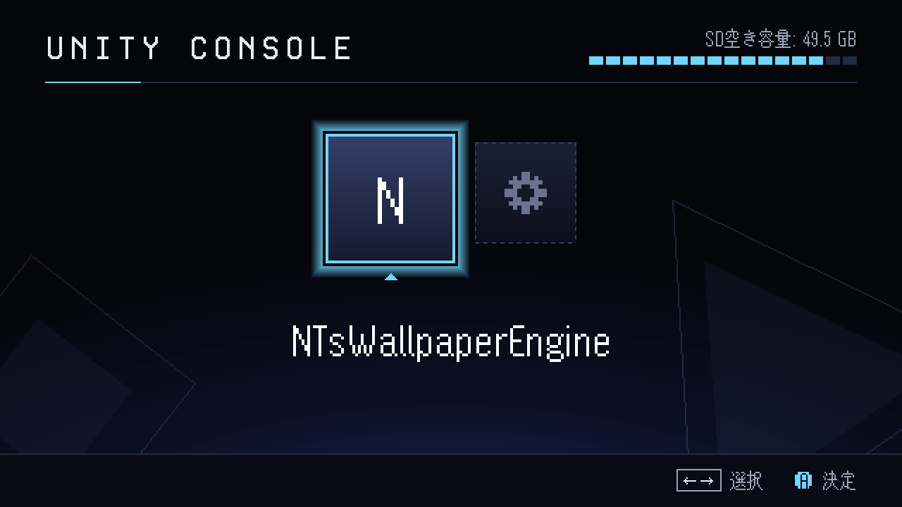
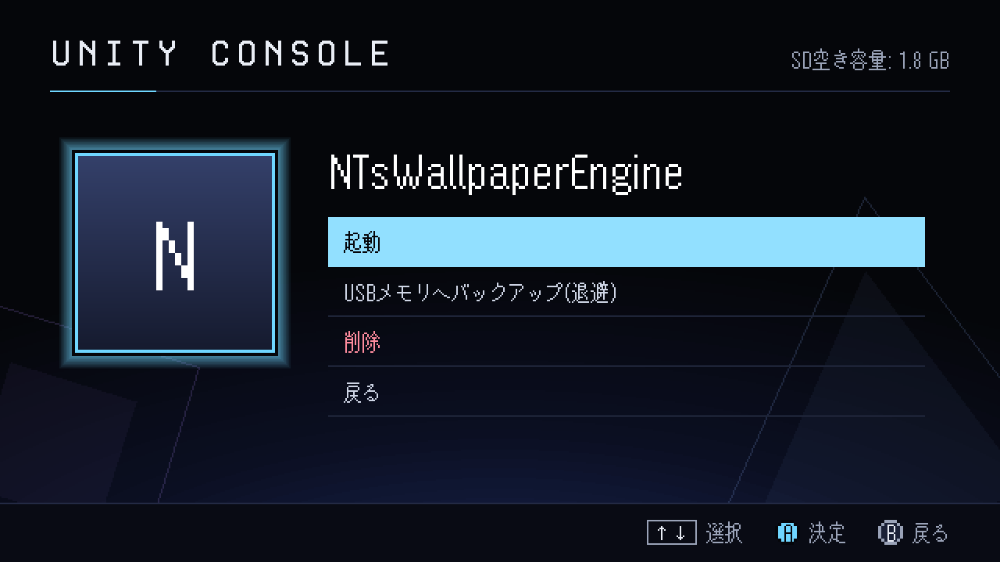
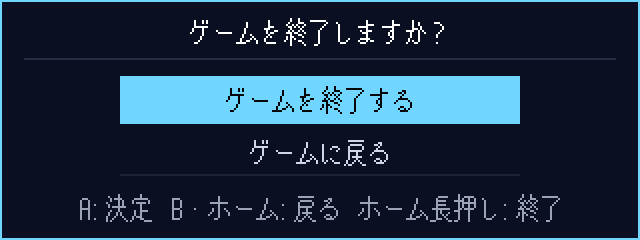
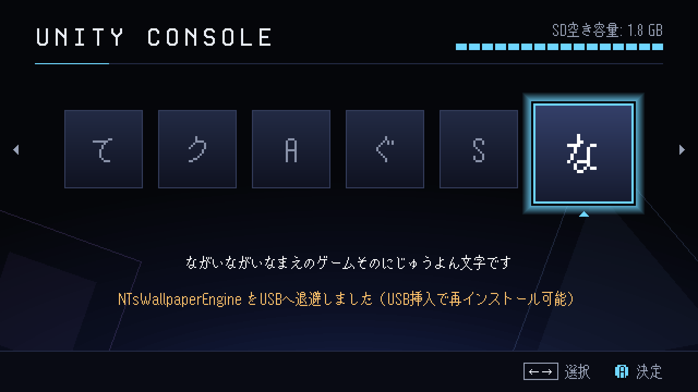
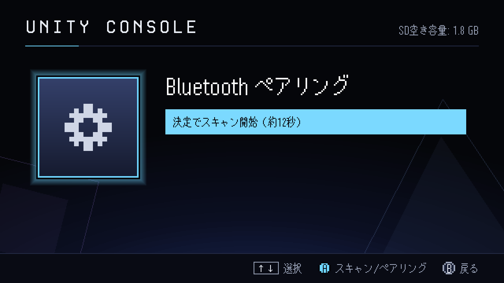
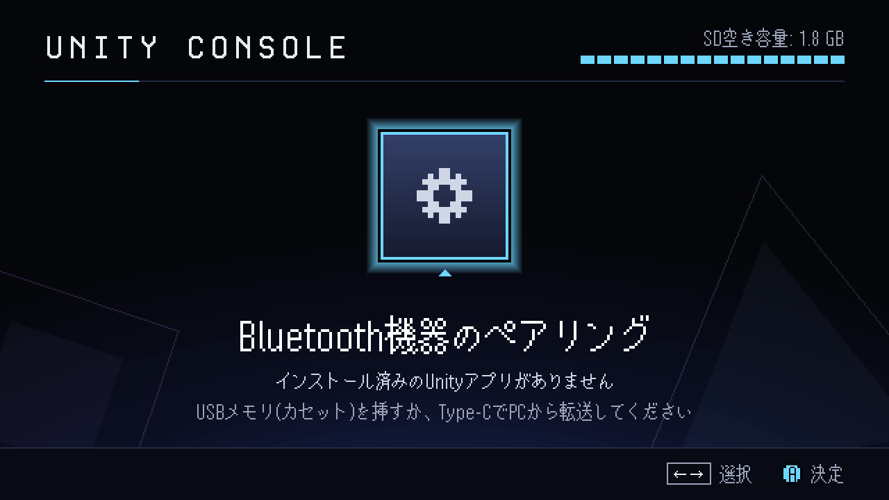

# RasPiOS_UnityConsole

Raspberry Pi 4 / 5 を **Unity 製ゲームを遊ぶためのゲーム機**にするオリジナル OS イメージ
（pi-gen / arm64 / Raspberry Pi OS Lite（Debian trixie）ベース）。
Unity の Linux (x86_64) ビルドを [box64](https://github.com/ptitSeb/box64) で動かし、
USB メモリの「ゲームカセット」を挿すだけで SD カードへ自動インストールする。

> **License**: [CC BY-SA 4.0](https://creativecommons.org/licenses/by-sa/4.0/deed.ja)（同梱フォント等は[対象外](#ライセンス)）
> © ラジアン（柏木主税） / RadianN_kswg



## 特長

| 機能 | 内容 |
| --- | --- |
| Unity アプリ実行 | box64 による Linux x86_64 ビルドの実行。Mesa の設定で OpenGLCore ビルドもそのまま動く |
| USB カセット | USB メモリの `/UnityGames/` に置いたビルドフォルダや zip を、挿すだけで自動インストール |
| Type-C 転送・保守 | Type-C 1本で給電 + USB 複合ガジェット。シリアルでアプリ転送（`tools/send-app.py`）、USB ネットワークで SSH 保守 |
| ランチャー | 平成のゲーム機本体を思わせるドット絵 UI。アプリ終了後もここに戻る |
| 退避 | SD が一杯になったら、ランチャーからアプリを USB メモリへ移動（挿し直せば再インストール） |
| 入力 | USB / Bluetooth のゲームパッド・キーボード（ランチャーにペアリング画面あり） |
| ホームボタン | GPIO に挿す小基板。ゲーム中に短押しで一時停止＋終了確認、長押しで即終了（[設計データ](docs/home-button.md)） |

## 画面

いちばん上の画像は実機の HDMI 出力。下の画像は同じランチャーを Pi 上でオフスクリーン描画したもので、
ソフト名・メッセージ・空き容量は表示例。

| ソフトメニュー | 終了確認（ホームボタン短押し） |
| --- | --- |
|  |  |
| **ソフトが多いとき（横スクロール）** | **Bluetooth ペアリング** |
|  |  |
| **ソフトが無いとき** | |
|  | |

- 640×360 の論理解像度で描き、画面に収まる最大の整数倍で拡大する（1280×720 なら2倍、1920×1080 なら3倍）ので、ドットが崩れない。
- ソフトは横並びのブロック（文字はソフト名の頭文字）。右上のブロック列は SD 全体に対する空き容量（16段）。
- 見出しは「ヘッドアップデイジー」、本文は「マルモニカ」。どちらも 患者長ひっく さんの
  [ゼロピクセルフリーフォント](https://hicchicc.github.io/00ff/)。
- SFC・PS・SEGA 世代のゲーム機本体画面を参考に3案を作って比べ、32ビット CD-ROM 世代風の「ディスク・ブラウザ」案を採用した。

## はじめかた

1. [Releases](https://github.com/radiann-kswg/RasPiOS_UnityConsole/releases) から `*.img.xz` をダウンロードする
   （SHA256 はリリースノートに記載）。自分でビルドする場合は [docs/build.md](docs/build.md)。
2. Raspberry Pi Imager の「カスタムイメージを使う」で microSD（16GB 以上）へ書き込む。
   Imager の OS カスタマイズ（ユーザー名・Wi-Fi 等）は使わない。
3. Pi に microSD を挿し、HDMI とゲームパッド（またはキーボード）をつないで電源を入れる。
   初回はパーティション拡張のために一度自動で再起動し、約1分半でランチャーが出る。
4. **初期アカウントは `player` / `player` で、SSH が有効**。有線 LAN などのネットワークにつなぐ前に、
   Type-C で PC とつないで `ssh player@10.89.0.1` で入り、`passwd` でパスワードを変える
   （[USB リンクの詳細](docs/maintenance.md#type-c-の-usb-リンク)）。

## Unity アプリの作り方

1. Unity で **Linux (x86_64)** 向けにビルドする（Unity Personal で可）。
2. ビルド一式をフォルダ（または zip）にまとめる。フォルダ名がアプリ ID になる。

```
MyGame/
  MyGame.x86_64        ← 実行ファイル（必須・1つ）
  MyGame_Data/
  UnityPlayer.so
  game.json            ← 任意（表示名と起動引数）
```

```json
{"name": "表示名", "args": ["-screen-fullscreen", "1", "-screen-width", "960", "-screen-height", "540"]}
```

## アプリの入れ方

**A. USB メモリ（ゲームカセット）** — USB メモリのルートに `UnityGames/` フォルダを作り、
ビルドフォルダか zip を置いて本体の USB ポートに挿す。SD へ自動でインストールされ、ランチャーに通知が出る。
導入済みの同名アプリはスキップするので、挿しっぱなしでもよい。どのポートに挿してもよい
（既定では青い USB 3.0 ポートも USB 2.0 として動かす。[理由](docs/maintenance.md#pi-4-の-usb-30青ポートについて)）。

**B. Type-C ケーブル（PC から転送）** — 本体の Type-C 端子と PC をつなぐと、PC にシリアルポートが現れる。

```bash
pip install pyserial
python tools/send-app.py COM5 MyGame.zip        # Linux なら /dev/ttyACM0
```

**C. SSH** — 同じ Type-C 接続で `ssh player@10.89.0.1` に入れる。ファイルを置いて `ucon-install <zip|フォルダ>` でも導入できる。

## 操作

| 操作 | ランチャー | ゲーム中 |
| --- | --- | --- |
| ←→ / ↑↓（十字キー・スティック） | 選択 | — |
| A / Enter | 決定 | — |
| B / Esc | 戻る | — |
| ホームボタン 短押し | — | 一時停止して終了確認 |
| ホームボタン 長押し（2秒） | — | すぐに終了 |

ソフトを決定すると「起動 / USBメモリへバックアップ(退避) / 削除 / 戻る」を選べる。
ゲームパッドのボタン番号の割り当ては機種によって異なる（ボタン0 が A、ボタン1 が B）。
パッドは起動後の接続や抜き差しにも対応する（ランチャーが再認識する）。

## 対応ハードウェアと検証状況

| 対象 | 状況 |
| --- | --- |
| Raspberry Pi 4B | 実機で確認済み（起動、USB カセット導入、ゲーム実行、退避と再導入、ランチャー表示。HDMI 1280×720、Type-C を PC に接続して給電） |
| Raspberry Pi 5 | 設定は入っているが実機未検証（box64 のため 4K ページカーネルを使う） |
| ホームボタン基板 | 設計・発注データのみ（実基板は未製作。GPIO を模擬して動作確認済み） |

box64 によるエミュレーションなので CPU 負荷は高く、重い 3D ゲームは厳しい。
USB メモリは「ゲームカセット」として使うため、USB メディアからの起動とは併用しない。

## ドキュメント

- [docs/build.md](docs/build.md) — イメージのビルド（WSL2 を含む）とステージ構成
- [docs/maintenance.md](docs/maintenance.md) — USB リンク、ファイルだけの更新、カセットと退避の仕組み、本体内のパス、既知の注意点
- [docs/home-button.md](docs/home-button.md) — ホームボタン基板と JLCPCB 発注

## リポジトリ構成

```
config                     pi-gen 設定（arm64 / trixie / STAGE_LIST）
build-image.sh             ビルドラッパー（pi-gen の取得 → 独自ステージ同期 → ビルド）
stage-unityconsole/
  00-base/                 パッケージ・config.txt・ディレクトリ・権限
  01-box64/                box64 の導入
  02-gadget/               Type-C USB ガジェット（NCM + ACM）・dnsmasq・シリアル受信
  03-cartridge/            USB カセット自動インストール・退避 CLI
  04-launcher/             ランチャー（キオスク X セッション）と同梱フォント
  05-purge-cloud-init/     cloud-init の除去（必ず最後）
tools/send-app.py          PC 側のアプリ転送ツール（pyserial）
hardware/home-button/      ホームボタン基板（KiCad 10）と JLCPCB 発注データ
docs/                      ドキュメントと画面画像
```

## ライセンス

本リポジトリの独自制作物（ビルド構成・スクリプト・ランチャー・PC 側ツール・ホームボタン基板の設計データ・
ドキュメント・画面デザインと画面画像）は
**[Creative Commons 表示 - 継承 4.0 国際 (CC BY-SA 4.0)](https://creativecommons.org/licenses/by-sa/4.0/deed.ja)**
で公開しています。ライセンス正文は [LICENSE](LICENSE) を参照してください。
改変したものを公開するときは、同じ CC BY-SA 4.0（または互換ライセンス）で公開してください。

**著作者（ライセンス主）: ラジアン（柏木主税） / RadianN_kswg**

利用時のクレジット表記例:

```
RasPiOS_UnityConsole by ラジアン（柏木主税） / RadianN_kswg
CC BY-SA 4.0 https://creativecommons.org/licenses/by-sa/4.0/
```

### 同梱物・サードパーティ

- **フォント**（`stage-unityconsole/04-launcher/files/fonts/` の `x12y16pxMaruMonica.ttf` と `x14y24pxHeadUpDaisy.ttf`）
  — © hicc（患者長ひっく）、[ゼロピクセルフリーフォント](https://hicchicc.github.io/00ff/)。
  **CC BY-SA 4.0 の対象外**で、作者の独自ライセンス（ソフトウェアへの同梱・再配布・商用利用は可、
  フォント単体の販売は不可など）に従います。要約は [fonts/README.md](stage-unityconsole/04-launcher/files/fonts/README.md)、
  正式な規約は配布サイトを参照してください。
- ビルド基盤 [pi-gen](https://github.com/RPi-Distro/pi-gen)（BSD 3-Clause）は**本リポジトリに含まれず**、
  ビルド時に `build-image.sh` が取得します。
- [box64](https://github.com/ptitSeb/box64)（MIT）は本リポジトリに含まれず、ビルド時に
  [box64-debs](https://github.com/ryanfortner/box64-debs) から OS イメージへ導入されます。
- ビルドで生成される **OS イメージには Raspberry Pi OS / Debian の各パッケージが含まれ、それぞれのライセンス**
  （GPL ほか）に従います。CC BY-SA 4.0 が適用されるのは本リポジトリ収録の独自制作物のみです。
  パッケージの一覧は各リリースに添付する `.info` ファイルにあり、ソースコードは Debian と
  Raspberry Pi のアーカイブ（`apt-get source <パッケージ名>`）から入手できます。
- 「Unity」は Unity Technologies、「Raspberry Pi」は Raspberry Pi Ltd の商標です。
  本プロジェクトはいずれとも関係のない非公式のプロジェクトです。

### クレジット

- **患者長ひっく（hicc）さん** — ランチャーのピクセルフォント（ゼロピクセルフリーフォント）。
- **Claude（Anthropic）** — Cowork の Agent 機能による設計・実装・実機デバッグ支援、Claude Design による画面デザイン案の作成。
