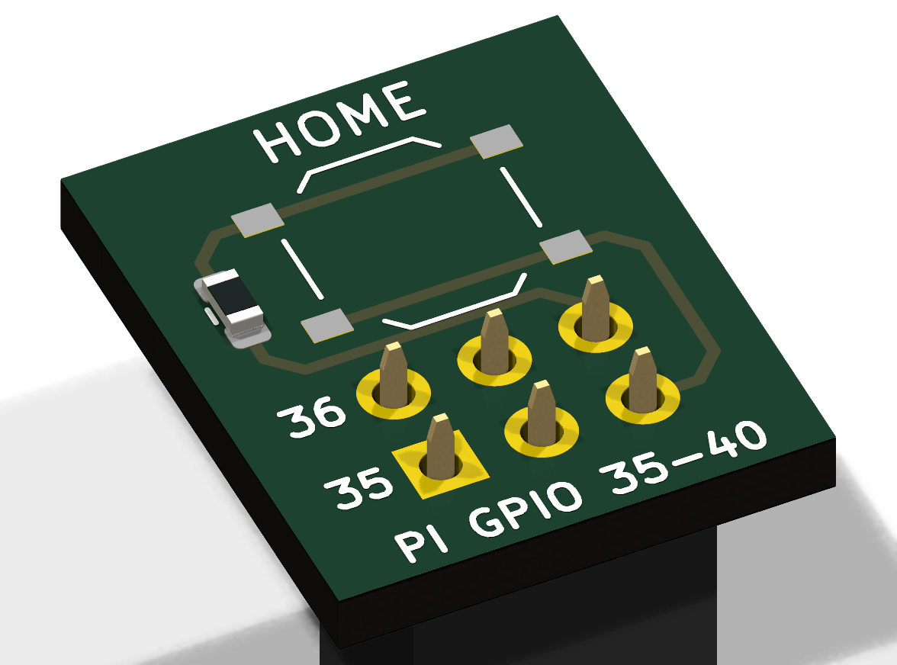

# RasPiOS_UnityConsole

Raspberry Pi をオリジナルゲーム機にするOSイメージ。
Unityで開発したゲーム（Linux x86_64ビルド）を box64 エミュレーションで実行し、
USBメモリ「ゲームカセット」やType-C接続のPCからSDカードへ自動インストールする。

## 対応ハードウェア

- Raspberry Pi 4 / Raspberry Pi 5（arm64・64bitイメージ）
- Pi 5では box64（汎用arm64ビルド、4KBページ前提）のため `kernel=kernel8.img` で4Kページカーネルを使用
- Pi 4B 実機での通し検証は未実施

1台の Pi 4B を本プロジェクトの他イメージ（DigitalSignage / GadgetMonitor）と切り換えて使う手順は
[../docs/pi4b-image-switching.md](../docs/pi4b-image-switching.md) を参照。
標準はmicroSDの差し替え。USBメモリは「ゲームカセット」として使うため、USBメディアからの起動と併用しないこと。

## 機能

| 機能 | 実装 |
| --- | --- |
| Unityアプリ実行 | box64 による Linux x86_64 ビルドのエミュレーション実行 |
| Type-C転送 | USB複合ガジェット(CDC-NCM + CDC-ACM)。シリアル側へPCから `tools/send-app.py` でzipを送ると自動インストール。NCM側はSSH保守リンク(10.89.0.1) |
| USBカセット | USBメモリ挿入をudevで検知し `/UnityGames/` 配下のzip・フォルダを自動インストール |
| ランチャー | 起動時にフルスクリーンのアプリ一覧を表示（pygame・レトロゲーム機風UI、後述）。アプリ終了後もここに戻る |
| バックアップ | SD容量不足時、ランチャーからアプリをUSBメモリへ退避（USBは再挿入でカセットとして機能） |
| 入力 | USB接続のキーボード/マウス/ゲームパッド、Bluetooth機器（ランチャーにペアリング画面あり） |
| ホームボタン | GPIO 35〜40番ピンに挿す物理ボタン基板。ゲーム中に短押しで一時停止＋終了確認、長押し(2秒)で即終了（後述） |

## Unityアプリの作り方（要件）

1. Unityで **Linux (x86_64)** をターゲットにビルドする（Unity Personalで可）。
2. Player設定で **Vulkan** を優先Graphics APIにすることを推奨
   （Raspberry PiのOpenGLは3.1相当のため。`-force-vulkan` 起動引数でも可）。
3. ビルド一式をフォルダまたはzipにまとめる:

```
MyGame/                ← この名前がアプリIDになる
  MyGame.x86_64        ← 実行ファイル（必須・1つ）
  MyGame_Data/
  UnityPlayer.so
  game.json            ← 任意: {"name": "表示名", "args": ["-force-vulkan"]}
```

## アプリの入れ方

**方法A: USBメモリ（ゲームカセット）**
USBメモリのルートに `UnityGames/` フォルダを作り、その中にzipまたはビルドフォルダを置いて
本体のType-Aポートに挿すだけ。自動でSDへインストールされ、ランチャーに通知が出る。
（導入済みの同名アプリはスキップされるため、挿しっぱなしでも安全）

**方法B: Type-Cケーブル（PCから転送）**
本体のType-C端子（電源端子）とPCをUSBケーブルで接続すると、PC側にシリアルポート
（Windows: COMx / Linux: /dev/ttyACM0）が現れる。

```
pip install pyserial
python tools/send-app.py COM5 MyGame.zip
```

※ Type-Cからの給電が不足する場合はセルフパワーUSBハブ経由やPD対応ポートを使用。

**方法C: Type-Cケーブル経由のSSH（保守・再デプロイ）**
同じType-C接続でPC側には「UsbNcm Host Device」（USBネットワークアダプタ）も現れ、
PCは 10.89.0.10〜20 をDHCPで取得する。`ssh player@10.89.0.1` で保守でき、
`WSLSettings/scripts/deploy-unitycon.sh` は stage 内の `files/` を実機へ直接再配備する
（イメージ再ビルド不要。ガジェット設定は `/boot/firmware/unitycon.conf`）。
サブネットは GadgetMonitor 10.87 / NTsWallpaper 10.88 / Pi5仮OS 10.86 と衝突しない 10.89.0.0/24。

## ホームボタン（GPIO）



GPIOヘッダの **35〜40番ピン**（USB端子側の端）に 2x3 ソケットで挿す小基板（12.5×15mm）。
ボタン側は Pi の基板端より外へ張り出す向きに挿す（シルクの `35` `36` がヘッダ側、`HOME` が外側）。

| 操作 | 動作 |
| --- | --- |
| ゲーム中に短押し | ゲームを一時停止(SIGSTOP)して「ゲームを終了しますか？」を表示。A/Enter で決定、B/Esc かホーム短押しでゲームに戻る |
| ゲーム中に長押し(2秒) | 確認なしで終了（SIGTERM、5秒で終わらなければ SIGKILL） |
| ランチャー表示中 | 何もしない |

- OS側は `config.txt` の `dtoverlay=gpio-key,gpio=21,active_low=1,gpio_pull=up,keycode=172,label=HOME`
  （00-base で追記）が GPIO21 を KEY_HOMEPAGE の入力デバイスにし、ランチャーがゲーム実行中だけその evdev を直接読む
  （Xのフォーカスに依存しない）。ゲームは独立したプロセスグループで起動し、グループごと停止・終了する。
- **この機能より前に焼いたSDカード**は `deploy-unitycon.sh` の後、上記1行を `/boot/firmware/config.txt` の
  `dtoverlay=dwc2,dr_mode=peripheral` の下へ追記して再起動する。
- 回路: GPIO21(40番) ─ 1kΩ ─ タクトスイッチ ─ GND(39番)。プルアップは SoC 内蔵（約50kΩ、押下時 約0.07V）。
  35〜40番の周りには電源ピンが無いので、**逆向き・1列ずれで挿しても信号ピン同士か GND との短絡にしかならない**
  （1kΩ はそのとき出力ピンを GND に落とした場合の電流制限）。
- GPIO21 は I2S の PCM_DOUT と共用。I2S DAC 等の HAT と併用する場合はピン割当の変更が必要。
- 実機検証（2026-09-16, Pi 4B, NTsWallpaperEngine）: `pinctrl set 21 pd/pu` でボタン押下を模擬し、
  短押し→一時停止＋ダイアログ、再度短押し/「ゲームに戻る」→再開、「ゲームを終了する」→終了、
  長押し→約5秒でランチャーへ復帰、ランチャー表示中の押下→無反応を確認。**実基板は未製作**。

### 基板データと JLCPCB 発注

`hardware/home-button/` が KiCad 10 プロジェクト（ERC 0件 / DRC 0件・回路図との等価性チェック込み）。
発注用ファイルは `hardware/home-button/jlcpcb/`。

1. `home-button-gerber.zip` をアップロード（2層・1.6mm）。
2. PCB Assembly を有効化。J1（THTソケット）は**裏面**実装なので Standard を選ぶ。
   Economic にする場合は J1 を実装対象から外し、届いた基板に表側からはんだ付けする。
3. `home-button-bom.csv` と `home-button-cpl.csv` をアップロードし、プレビューで
   部品の位置と向き（特に裏面の J1 と SW1）を確認してから注文する。
   J1 の CPL 回転角は JLCPCB 側モデルに合わせて KiCad 出力（-90°）から +90° 補正した 0°
   （補正前はプレビューでソケット本体がパッド列と直交していた。2026-09-16 確認）。

| Ref | 部品 | LCSC | 備考 |
| --- | --- | --- | --- |
| SW1 | XKB TS-1187A-B-A-B（5.1mm角・高さ1.5mm・160gf） | C318884 | Basic |
| R1 | 1kΩ 0603 | C21190 | Basic |
| J1 | 2.54mm 2x3 メスソケット 高さ8.5mm（PM254-2-03-Z-8.5） | C2897404 | Extended・THT |

## ランチャーの画面

32ビットCD-ROM世代の本体メニューを意識した「ディスク・ブラウザ」デザイン
（Claude Design で3案を比較して採用。デザインキャンバス: https://claude.ai/artifact/FpPZBJiybHwMvGGY4ubZCD ）。

- 640×360 の論理解像度で描き、画面に収まる最大の整数倍で拡大表示する（1280×720 なら2倍、1920×1080 なら3倍）。
- ソフトは横並びのブロック。←→（↑↓も可）で選択、A/Enter で「起動 / USBメモリへバックアップ(退避) / 削除 / 戻る」。
  ブロックの文字はソフト名の頭文字。6本以上は横スクロール（端に矢印）。
- 右上の「SD空き容量」の下のブロック列は、SD全体に対する空きの割合（16段）。
- フォント: 見出しに ヘッドアップデイジー、本文に マルモニカ。
  いずれも 患者長ひっく さんの [ゼロピクセルフリーフォント](https://hicchicc.github.io/00ff/)。
  `stage-unityconsole/04-launcher/files/fonts/` に同梱し `/usr/share/fonts/truetype/00ff/` へ入る
  （利用規約の要約は同フォルダの `README.md`）。フォントが無い場合は Noto Sans CJK で表示する。
- 画面確認: `UCON_WINDOW=1280x720` を付けて起動すると全画面ではなく窓で開く。

## 容量不足時の運用

SDカードが一杯でインストールに失敗すると、ランチャーに通知が表示される。
ランチャーでアプリを選び「USBメモリへバックアップ(退避)」を実行すると、
アプリがUSBの `/UnityGames/` へ移動されSD容量が解放される。
退避したアプリはそのUSBを挿し直せば再インストールできる。

- FAT32 / exFAT のUSBメモリでよい。所有者・パーミッションは保存されない（実行ビットは再インストール時に付け直す）。
- USB上では `UnityGames/.<アプリ名>.tmp.<PID>` へコピーして検証後に差し替えるため、失敗しても
  USB上の既存コピーは消えない。必要容量はUSB側のクラスタサイズで見積もる。
- 画面には `ucon-backup` の要約（標準出力の最終行）が出る。`cp` 等の詳細は
  `journalctl -t ucon-backup` に残る。
- USBカセットの自動導入中（USBを読み込み専用で使用中）は退避できない。導入の通知が出てから実行する。
- 2026-09-16 までの版は `cp -a` が FAT で所有者を保存できずに必ず失敗し
  （画面には「…の所有者の保護に失敗しました: 許可されていない操作です」）、しかもコピー前に
  USB上の同名アプリを削除していた。

## ビルド方法

Cowork（サンドボックス）では実ビルド不可。Linux環境（WSL2可）で行います。

```bash
# 1. リポジトリを Linux ファイルシステムへ複製
#    Windows 側の開発ルートはパスに空白を含み、build-image.sh 冒頭のチェックで拒否される。
#    性能面でも NTFS 越え (/mnt/c /mnt/d) のビルドは避けること。
rsync -a --exclude 'pi-gen/' --exclude 'work/' --exclude 'deploy/' \
  "/mnt/d/Claude Coworks Projectfile/RaspberryPiOSEditor/RasPiOS_UnityConsole/" \
  ~/workspaces/RasPiOS_UnityConsole/
cd ~/workspaces/RasPiOS_UnityConsole

# 2. ビルド
./build-image.sh docker   # Docker Desktop (WSL2バックエンド) 推奨
# または
./build-image.sh native   # Debian/Ubuntu実機 (要 sudo・依存パッケージ)
```

- Docker モードでも**ホストに `qemu-user-binfmt` が必要**です。`pi-gen/build-docker.sh` が
  コンテナ起動**前**に `which qemu-arm` を確認し、無ければ即終了します。
- 本リポジトリは **arm64 ブランチ**（Debian 公式アーカイブ）を使うため、armhf 側で必要な
  Raspbian 署名鍵の SHA-1 回避（`SEQUOIA_CRYPTO_POLICY`）は**不要**です。
- 環境準備は `WSLSettings` リポジトリの `scripts/setup-pigen.sh` が一括で行います。
  検証の詳細は同リポジトリの `docs/raspberrypi-pigen-build-verification.md` を参照。
- 再実行前に `docker rm -f pigen_work`（残っていると "already exists" で止まります）。
- 長時間かかるため、対話セッションから回すときは
  `nohup setsid ./build-image.sh docker > build.log 2>&1 &` でバックグラウンド起動し
  `tail -f` で追ってください。

成果物: `pi-gen/deploy/*.img.xz` → Raspberry Pi Imager等でSDカードへ書き込み。

WSL2 では `WSLSettings/scripts/build-unitycon.sh`（同期→静的検証→binfmt→systemd-run でバックグラウンドビルド、
ログ `/root/unitycon-build.log`）、SD書き込みは同 `flash-unitycon.ps1`（管理者PowerShell・生書き込み・SHA256照合）が定型。

> 注意: box64はビルド時（chroot内）に https://ryanfortner.github.io/box64-debs/
> からインストールされるため、ビルドマシンにインターネット接続が必要。

## 初期アカウント

- ユーザー: `player` / パスワード: `player`（**運用前に必ず変更**）
- ホスト名: `unitycon`、SSH有効（メンテナンス用）

## 構成

```
config                     pi-gen設定 (arm64/trixie, STAGE_LIST)
build-image.sh             ビルドラッパー (pi-gen clone→stage同期→build)
stage-unityconsole/
  00-base/                 パッケージ・boot設定(dwc2/4Kページ)・ディレクトリ・権限
  01-box64/                box64導入 (box64-debsリポジトリ)
  02-gadget/               Type-C USBガジェット(NCM+ACM複合) + dnsmasq(DHCP) + シリアル受信サービス
  03-cartridge/            USBカセット自動インストール + バックアップCLI
  04-launcher/             pygameランチャー (tty1キオスクXセッション)
  05-purge-cloud-init/     cloud-init の除去（後述）
tools/send-app.py          PC側転送ツール (pyserial)
hardware/home-button/      ホームボタン基板 (KiCad 10) と JLCPCB 発注データ
```

### 本体内の主なパス

- アプリ格納: `/var/lib/unityconsole/apps/<アプリ名>/`
- 通知ファイル: `/var/lib/unityconsole/notify.txt`（ランチャーが表示）
- CLI: `ucon-install` / `ucon-backup` / `ucon-usb-install`

## 補足: cloud-init について

pi-gen の `stage2/04-cloud-init/00-packages` は `cloud-init` と `rpi-cloud-init-mods` を
**無条件**に導入します。`config` の `ENABLE_CLOUD_INIT=0` が抑止するのは
`stage2/04-cloud-init/01-run.sh` による `boot/firmware/{meta-data,user-data,network-config}`
の配置だけで、パッケージ本体と systemd ユニットはイメージに残ります。

本リポジトリでは `stage-unityconsole/05-purge-cloud-init/` を最後のサブステージとして置き、
明示的に `apt-get purge` する構成にしています。先行サブステージで導入したパッケージが
`autoremove` の巻き添えにならないよう、**このサブステージは必ず最後**に置いてください。

## 制約・既知の注意点

- box64エミュレーションのため、重量級3Dゲームは性能不足になり得る（Pi 5推奨）。
- Unity 2021以降のLinuxビルドを想定。IL2CPP/Monoいずれも可。
- OpenGLCoreを要求するビルドは `-force-vulkan` の指定を推奨。
- Pi 4のType-Cはデータ線がガジェット対応。Pi 5も同様だが、給電要件（5V/5A推奨）に注意。
